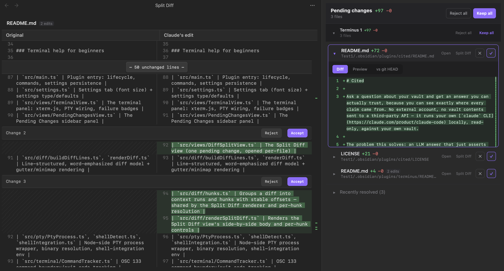

# Terminus

A real terminal inside Obsidian that never lets you lose the thread on what [Claude Code](https://claude.com/product/claude-code) just did. You type `claude` (or anything else) exactly like you would in any other terminal — nothing is wrapped or intercepted — and Claude keeps working through a whole multi-file turn uninterrupted. Two things happen because of that:

- **A command fails, and you don't leave the terminal to deal with it.** A small badge appears right next to the failed command. Click it and Claude explains what happened and proposes a fix, using the surrounding command history for context — no copying an error into a separate chat window and pasting the context back and forth by hand.
- **Claude finishes editing, and nothing is a mystery.** Every file it touched shows up in one Pending Changes panel — what changed, where, and by how much — with a real line-numbered diff per file and Accept / Reject / Edit right there. No more hunting for "where did that change happen"; even editor plugins built specifically for opening code in Obsidian don't show you a diff, and Terminus does.

Edits land on disk immediately; you review what changed afterwards, with the option to revert.

## Screenshots

| Split Diff — per-hunk Accept/Reject |
| --- |
|  |

| Command help — Explain / Suggest a fix |
| --- |
|  |

## Features

### Terminal

- **A real PTY-backed terminal** — full interactive shell (zsh/bash), not a fake console. Run anything, not just `claude`.
- **Multiple concurrent terminals** — open as many as you want; each runs its own session, defaulting to a numbered label ("Terminus 1", "Terminus 2", ...).
- **Rename and color-code terminals** — a pencil and palette icon in each terminal's own header let you give it a custom name and a color tag. Both show on the terminal's native tab, carry through into its Pending Changes group so you can tell at a glance which session made which edits, and survive an Obsidian restart (or a "Rescue closed terminal", below).
- **Choose where a new terminal opens** — clicking the ribbon icon (or running "Open Terminus") shows a quick menu: new tab, split right, split down, or new window. Set a fixed default in Settings to skip the menu entirely.
- **Drag-and-drop path insertion** — drag a note from Obsidian's file explorer, or a file from Finder/Explorer, onto a terminal to insert its absolute path into the input line (quoted if it has spaces), unexecuted.
- **Wiki-link autocomplete** — type `[[` in a terminal to fuzzy-search your vault's notes and insert one as a wiki-link, a vault-relative path, or an absolute path — configurable in Settings.
- **Scrollback and working-directory persistence** — closing and reopening Obsidian restores what was on screen (clearly marked as a previous session) and resumes each shell in the same directory you left it in, not the vault root.
- **Rescue closed terminals** — closed a tab by accident? The "Rescue closed terminal" command brings back its transcript, working directory, name, and color from a 10-entry buffer.
- **Startup command** — optionally run a fixed command (e.g. `claude`) automatically in every new terminal once its shell is ready.
- **Deep appearance settings** — font size and family, cursor style and blink, scrollback size, and a customizable ribbon icon, plus a terminal color theme that follows Obsidian's light/dark toggle automatically (`Cmd/Ctrl+=` / `Cmd/Ctrl+-` / `Cmd/Ctrl+0` also zoom font size live).

### Claude Code review workflow

- **Non-blocking by design** — a `PreToolUse` hook records the pre-edit snapshot of every file Claude touches, but never blocks the write. Claude finishes its whole turn; you review afterward.
- **Pending Changes panel** — a persistent sidebar panel, grouped by terminal (each group collapsible independently), showing every file changed with a line-numbered, word-level diff and a scroll minimap. Colors follow your vault's accent color rather than a fixed theme.
- **Comes to front automatically** — once Claude finishes a burst of edits, the panel reveals itself (debounced across a whole multi-file turn, so it doesn't interrupt mid-turn or pop up once per file). Toggleable in Settings, with an adjustable delay.
- **Accept / Reject, per file or in bulk** — Accept is a no-op (the file's already correct); Reject reverts to the exact pre-edit content (or deletes the file, if it was newly created). A global "Reject all" / "Keep all" covers everything; each terminal group also gets its own scoped (visually secondary) versions. Optionally require a confirmation before any bulk action (off by default — every one is already reversible via "Recently resolved").
- **Edits coalesce within a turn** — multiple edits to the same file in one turn merge into a single row with one true revert point, instead of several overlapping ones.
- **Undo, even after Accept** — a "Recently resolved" list lets you reverse either outcome after the fact.
- **Persistent, searchable action log** — a lightweight on-disk history (filename, stats, outcome) that survives Obsidian restarts, independent of the short in-memory undo list.
- **Rendered markdown preview** — toggle a pending change's diff view to see the note as it will actually render, not just raw markdown text.
- **Git-aware baseline** — for a vault under version control, an extra "vs git HEAD" diff view alongside the since-last-edit one (purely informational).
- **Backlink-breakage warnings** — flags when an edit removes a heading or block that other notes reference via `[[Note#Heading]]` or `[[Note#^block]]`.
- **Inline in-editor diff** — click "Open" on a pending change to see the diff directly in the real note, with Accept/Reject controls right there.
- **Split Diff view — per-hunk Accept/Reject** — click "Split Diff" on a pending change for a dedicated side-by-side (old | new) view with its own Accept/Reject bar on every individual changed block, so you can keep some edits and revert others within the same file instead of an all-or-nothing per-file decision. Not available for `NotebookEdit` changes, since their diff is a display-only approximation of the real file content and can't be safely spliced.
- **Keyboard-driven review** — accept/reject the oldest pending change without touching the panel.

### Terminal help for beginners

- **Shell integration** (zsh and bash) tracks every command's boundaries and exit code, without modifying your actual `.zshrc`/`.bashrc`.
- **Failure badges** — a small ⚠ appears next to any command that exits non-zero.
- **Explain this** — click the badge for a plain-English explanation of what happened, from an isolated `claude -p` call with no file/tool access. Its result has a fixed spot above the action buttons and stays there regardless of what else you do in the popup. Both this and Suggest a fix see not just the failed command but a few commands run right before it too, so a failure that's really about an earlier step (e.g. a `git push` failing because nothing was committed yet) gets diagnosed with that context, not just the last line.
- **Suggest a fix** — asks Claude for its single best corrective command with a one-sentence rationale, shown below the action buttons with its own Apply/Cancel. Apply types it into your terminal's input line, unexecuted — you review, edit, or press Enter yourself. Clicking "Suggest a fix" again gets the next-best option instead of repeating itself. Claude never runs anything on its own here.

## Commands

| Command | Default hotkey |
| --- | --- |
| Open Terminus | — |
| Open Pending Changes | — |
| Open Action Log | — |
| Rescue closed terminal | — |
| Increase terminal font size | `Cmd/Ctrl` `=` |
| Decrease terminal font size | `Cmd/Ctrl` `-` |
| Reset terminal font size | `Cmd/Ctrl` `0` |
| Accept oldest pending change | `Cmd/Ctrl` `Shift` `Enter` |
| Reject oldest pending change | `Cmd/Ctrl` `Shift` `Backspace` |
| Keep all pending changes | — |
| Reject all pending changes | — |

## How it works

**Review workflow.** The plugin auto-provisions a project-scoped `.claude/settings.local.json` in your vault wiring a `PreToolUse` hook (matching `Edit|Write|NotebookEdit`) to a bundled script. That script POSTs the tool call to a local, loopback-only HTTP server the plugin runs, which records the file's current content (before the write happens) and lets the hook return immediately — Claude is never blocked. Rejecting a change later writes that recorded content back to disk.

**Terminal.** There's no native-addon PTY dependency (no `node-pty`, no Electron-ABI rebuild headaches). A small bundled Python script (`resources/pty_helper.py`) allocates a real pseudo-terminal via Python's stdlib and proxies bytes between the PTY and its own stdio; the plugin talks to it with a plain `child_process.spawn`. The terminal UI is `xterm.js`.

**Shell integration.** Two tiny rc scripts (`resources/shell-integration/{zsh,bash}/`) get sourced by redirecting `ZDOTDIR` (zsh) or `HOME` (bash) for the *spawned shell only* — never the plugin's own Python helper process — restoring the real value immediately and chain-loading your actual `.zshrc`/`.bash_profile` before adding invisible `OSC 133` command-boundary markers and an `OSC 7` current-directory marker around each prompt. Nothing on disk is modified.

**Command help.** "Explain this" and "Suggest a fix" are standalone `claude -p` calls with `--allowedTools ""` — no file or shell access, pure Q&A — independent of whatever's running in any terminal, so they work even if no terminal has `claude` open at all.

**Wiki-link autocomplete.** A real terminal has no local echo — everything on screen is echoed back by the *remote* shell's own readline, not rendered by the plugin. So typing `[[` can't be reacted to after the fact; it's intercepted before either character ever reaches the shell, and a resolved link/path is written in its place only once you actually pick one.

## Requirements

- macOS or Linux (Windows isn't supported — shell integration and the PTY helper are Unix-specific).
- Python 3.9+ (`pty_helper.py` uses `os.waitstatus_to_exitcode`, added in 3.9) and the [`claude` CLI](https://claude.com/product/claude-code) installed and logged in. Both are auto-detected (including a login-shell `PATH` lookup, since Obsidian launched from Finder/Dock often inherits a minimal one); if detection ever picks the wrong binary, Settings has manual overrides for the shell and Python 3 paths.
- `git` is optional, only needed for the "vs git HEAD" diff view.

## Development

```sh
npm install
npm run dev    # unminified build with inline sourcemaps
npm run build  # typecheck + minified production build
```

The build bundles `src/main.ts` into `main.js` with esbuild, and regenerates `styles.css` from `src/css/custom.css` plus xterm.js's own stylesheet. Copy (or symlink) the plugin folder into `<vault>/.obsidian/plugins/terminus/` and enable it in **Settings → Community plugins**.

## Layout

| Path | Role |
| --- | --- |
| `src/main.ts` | Plugin entry: lifecycle, commands, settings persistence |
| `src/settings.ts` | Settings tab + settings type/defaults |
| `src/views/TerminalView.ts` | The terminal panel: xterm.js, PTY wiring, failure badges, rename/color identity |
| `src/views/PendingChangesView.ts` | The Pending Changes sidebar panel |
| `src/views/DiffSplitView.ts` | The Split Diff view (one pending change, opened per-file) |
| `src/diff/buildDiffLines.ts`, `renderDiff.ts` | Line-structured, word-emphasized diff model + gutter/minimap rendering |
| `src/diff/hunks.ts` | Groups a diff into context runs and hunks with stable offsets — shared by the Split Diff renderer and per-hunk resolution |
| `src/diff/renderSplitDiff.ts` | Renders the Split Diff view's side-by-side body and per-hunk controls |
| `src/pty/PtyProcess.ts`, `shellDetect.ts`, `shellIntegration.ts` | Node-side PTY process wrapper, binary resolution, shell-integration env |
| `src/terminal/oscHandler.ts` | Shared workaround for xterm.js's non-functional public `registerOscHandler` |
| `src/terminal/CommandTracker.ts` | OSC 133 command-boundary/exit-code tracking |
| `src/terminal/CwdTracker.ts` | OSC 7 working-directory tracking |
| `src/terminal/WikiLinkAutocomplete.ts` | `[[` fuzzy note picker inside the terminal |
| `src/terminal/TerminalColorPicker.ts`, `colorPalette.ts`, `tabHeaderColor.ts` | Color-swatch popover, preset palette, and the native-tab tint/title-refresh |
| `src/server/ReviewServer.ts`, `diff.ts` | Local hook-bridge HTTP server, diff computation |
| `src/state/PendingChangesStore.ts`, `ActionLog.ts` | In-memory pending/undo state, persisted action log |
| `src/state/ClosedTerminalBuffer.ts` | Ring buffer backing "Rescue closed terminal" |
| `src/hooks/provisionSettings.ts`, `types.ts` | `.claude/settings.local.json` provisioning, hook payload types |
| `src/editor/inlineDiff.ts`, `openWithDiff.ts` | CodeMirror 6 inline diff overlay |
| `src/backlinks/breakage.ts` | Backlink-breakage detection |
| `src/git/gitDiff.ts` | Git HEAD baseline diff |
| `src/claude/headlessAssist.ts` | Standalone `claude -p` calls for explain/suggest-fix |
| `src/modals/` | Diff preview, action log, command-help, rename, and rescue-terminal modals |
| `resources/pty_helper.py` | PTY allocation helper (spawned by the plugin) |
| `resources/hook-bridge.sh` | `PreToolUse` hook → local server bridge |
| `resources/shell-integration/{zsh,bash}/` | Shell rc scripts for command tracking and cwd tracking |

## License

MIT — see [LICENSE](LICENSE).
